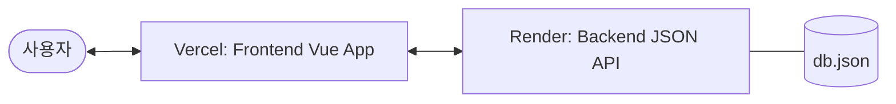
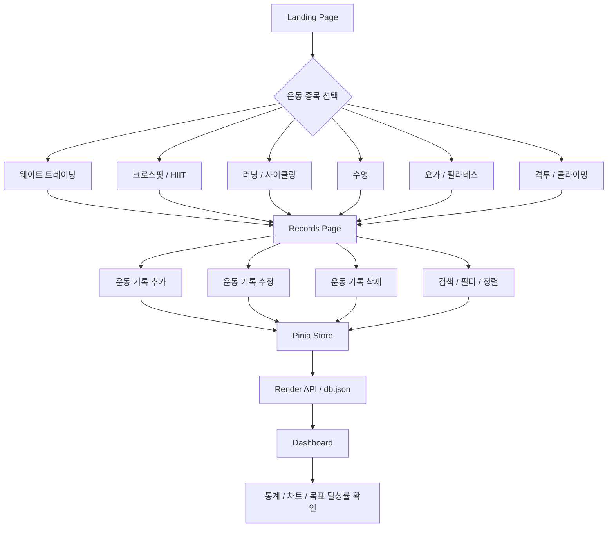
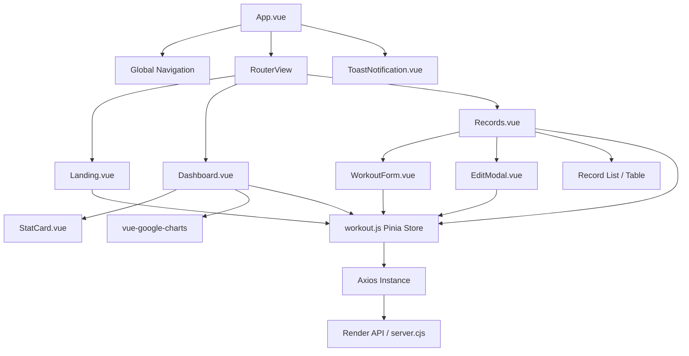

# FitTracker — Vue Workout Dashboard

> 운동 기록을 빠르게 남기고, 주간 목표와 누적 운동 데이터를 한눈에 확인할 수 있는 Vue 기반 피트니스 대시보드입니다.  
> 종목 선택 → 맞춤 기록 입력 → 대시보드 분석까지 이어지는 개인 운동 기록 관리 웹앱입니다.

<br />

<p align="center">
  
</p>

<br />

## Overview

**FitTracker**는 단순히 운동 기록을 저장하는 것을 넘어, 사용자가 자신의 운동 루틴을 시각적으로 이해할 수 있도록 설계한 대시보드형 웹 애플리케이션입니다. 현재 이 프로젝트는 프론트엔드와 백엔드가 분리되어 각각 Vercel과 Render를 통해 배포되어 있습니다.

- 운동 종목별 맞춤 기록 입력
- 주간 목표 설정 및 달성률 확인
- 운동 유형, 칼로리, 평균 운동 시간, 월별 기록 시각화
- 라이트/다크 테마 지원
- JSON Server 기반 CRUD 데이터 관리 (Render 호스팅)

<br />

## Tech Stack

| Category | Stack |
| --- | --- |
| Frontend | Vue 3, Composition API, Vite |
| State Management | Pinia |
| Routing | Vue Router 4 |
| HTTP Client | Axios |
| Mock API | JSON Server |
| UI / Style | Bootstrap 5, Custom CSS, Font Awesome |
| Chart | vue-google-charts |
| **Deployment (FE)** | **Vercel** |
| **Deployment (BE)** | **Render** |

<br />

## Screenshots

### Landing

<p align="center">
  
  
</p>

### Dashboard

<p align="center">
  
</p>

### Records

<p align="center">
  
</p>

<br />

## Main Features

### 1. 종목 선택형 랜딩 페이지

랜딩 페이지에서 운동 종목을 선택하면 해당 종목에 맞는 기록 화면으로 이동합니다.

지원 종목은 다음과 같습니다.

- 웨이트 트레이닝
- 크로스핏 / HIIT
- 러닝 / 사이클링
- 수영
- 요가 / 필라테스
- 격투 / 클라이밍

### 2. 운동 기록 CRUD

JSON Server를 활용해 운동 기록을 생성, 조회, 수정, 삭제할 수 있습니다. 백엔드는 Render에 배포되어 있으며, `db.json`을 데이터베이스로 활용합니다.

- 운동 날짜, 종류, 시간, 소모 칼로리 등 기본 정보 기록
- 웨이트/크로스핏 전용 세부 운동 정보 관리
- 조건별(검색, 필터, 정렬) 데이터 조회 및 페이징

### 3. 주간 목표 관리

사용자는 주간 목표를 직접 설정하고 진행률을 실시간으로 확인할 수 있습니다.

- 주간 운동 횟수, 칼로리, 운동 시간 목표 설정
- 목표 대비 달성률 프로그레스 바 표시

### 4. 데이터 기반 대시보드

Pinia Store를 기반으로 운동 데이터를 집계하고, Google Charts를 통해 시각화합니다.

- 운동 유형별 비중 및 평균 시간 분석
- 날짜별 칼로리 추이 및 월별 세션 통계
- 총 운동량 인사이트 제공

### 5. 사용자 경험 개선 요소

- 다크모드 / 라이트모드 전환
- 최근 선택 종목 저장 (LocalStorage)
- 실시간 토스트 알림
- 반응형 웹 디자인 (모바일 최적화)

<br />

## Deployment Architecture

프론트엔드와 백엔드가 각각 최적화된 플랫폼에 배포되어 유기적으로 통신합니다.



- **Frontend (Vercel)**: `vite build`를 통한 정적 파일 배포 및 CI/CD 자동화
- **Backend (Render)**: `server.cjs`를 이용한 Node.js 기반 `json-server` 실행 및 API 제공

<br />

## User Flow



<br />

## Component Architecture



<br />

## Folder Structure

```bash
.
├── server.cjs          # Render 백엔드 서버 설정
├── db.json             # JSON 데이터베이스
├── render.yaml         # Render 배포 설정 파일
├── docs/               # 문서용 이미지 에셋
├── src/
│   ├── components/     # 재사용 UI 컴포넌트
│   ├── constants/      # 스포츠 종목 설정값
│   ├── router/         # Vue Router 설정
│   ├── stores/         # Pinia 상태 관리
│   ├── views/          # 페이지 단위 컴포넌트
│   ├── App.vue
│   └── main.js
├── package.json
└── vite.config.js
```

<br />

## Getting Started

### 1. 환경 변수 설정

프로젝트 루트에 `.env` 파일을 생성하고 백엔드 API 주소를 설정합니다.

```env
VITE_API_BASE_URL=https://your-render-api-url.onrender.com
```

### 2. 의존성 설치

```bash
npm install
```

### 3. 로컬 실행 (Frontend + API 함께 실행)

```bash
npm run start
```

### 4. 개별 실행

```bash
# Frontend (Vite)
npm run dev

# Backend (JSON Server)
npm run api
```

<br />

## Available Scripts

| Script | Description |
| --- | --- |
| `npm run dev` | Vite 개발 서버 실행 |
| `npm run api` | `server.cjs`를 통한 백엔드 서버 실행 |
| `npm run start` | 프론트엔드와 백엔드 동시 실행 (개발용) |
| `npm run build` | 프로덕션 빌드 생성 (Vercel 배포 시 사용) |

<br />

## Key Implementation Points

### 배포 환경에 따른 API 연동

`src/stores/workout.js`에서는 환경 변수 `VITE_API_BASE_URL`이 있으면 해당 주소를 API Base로 사용하고, 없을 경우 `/api` (로컬 프록시)를 사용합니다.

### CORS 및 JSON Server 커스텀

`server.cjs`에서 Render 배포를 위해 CORS 설정을 적용하고 `json-server`를 커스텀하여 `/api` 엔드포인트를 지원하도록 구성했습니다.

### 종목별 설정 분리

`src/constants/sports.js`에서 종목별 라벨, 아이콘, 입력 모드 등을 관리하여 유지보수성을 높였습니다.

<br />

## Future Improvements

- 실제 DB(PostgreSQL/MongoDB) 연동 및 사용자 인증 도입
- 월간/연간 목표 설정 및 성과 리포트 기능
- 운동 루틴 공유 및 템플릿 기능
- 캘린더 기반 시각화 뷰 고도화

<br />

---

<p align="center">
  <strong>FitTracker</strong><br />
  Build better habits with workout data.
</p>
