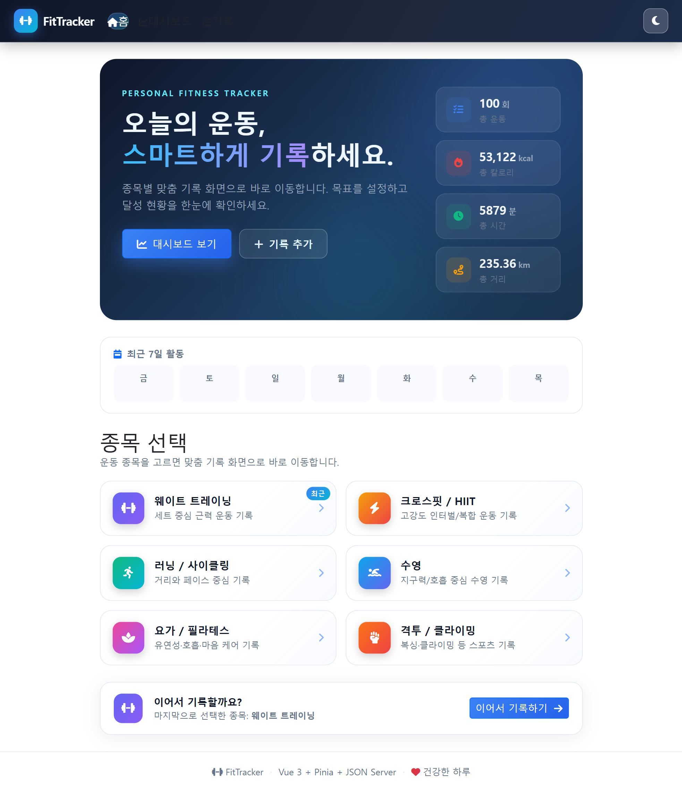
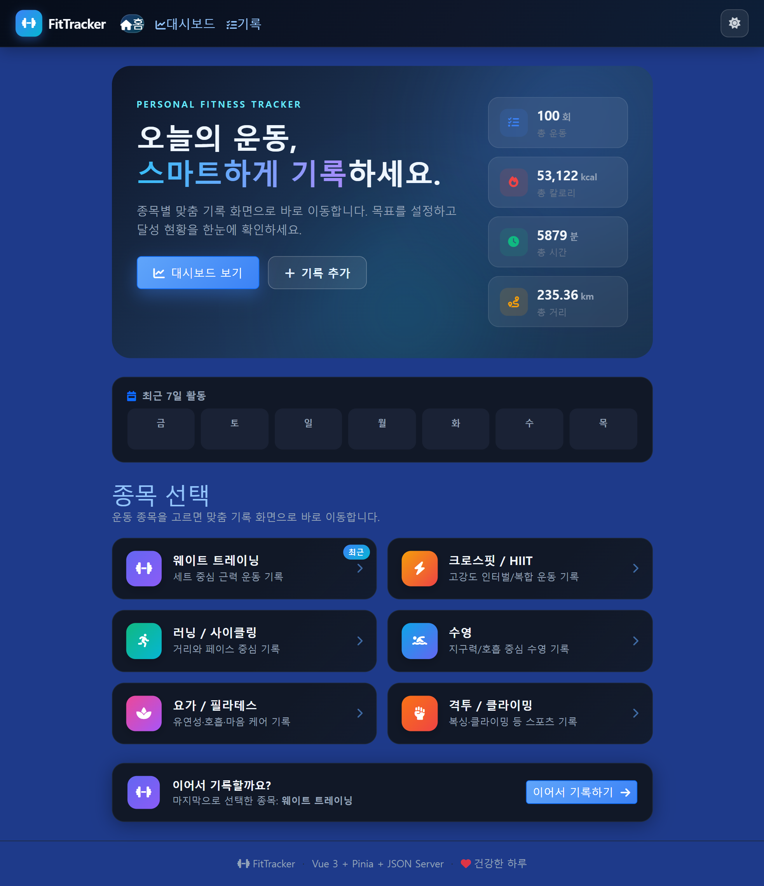
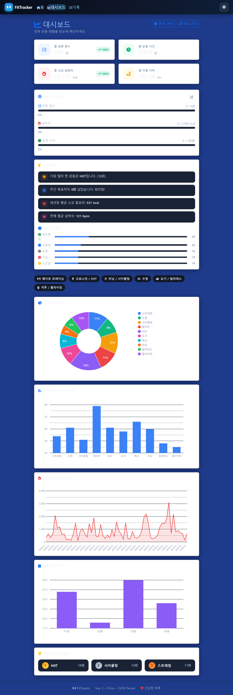
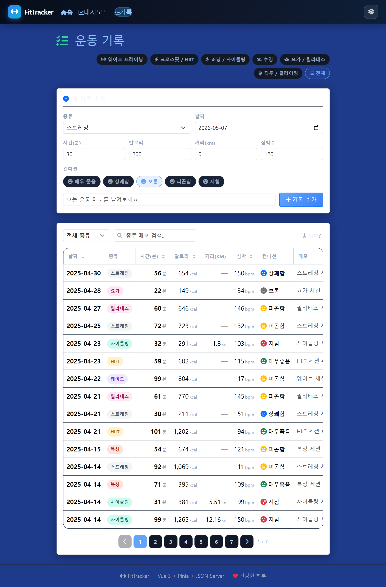
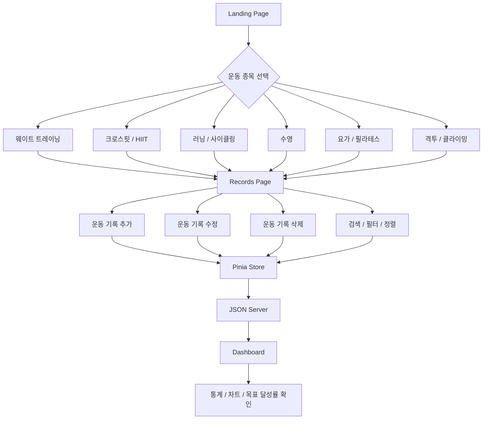
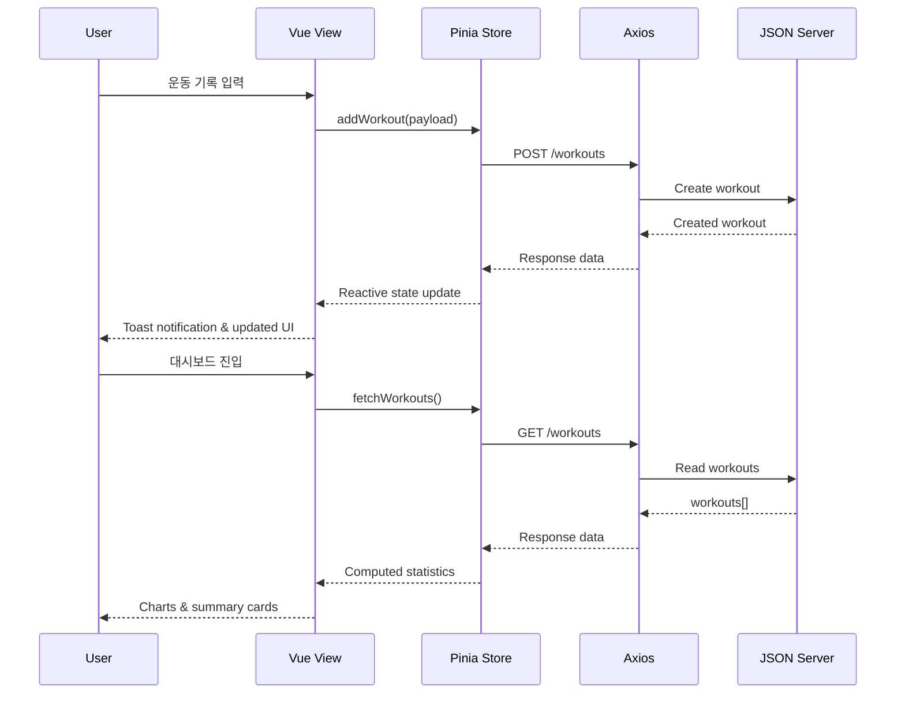
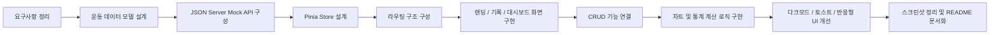

# FitTracker — Vue Workout Dashboard

> 운동 기록을 빠르게 남기고, 주간 목표와 누적 운동 데이터를 한눈에 확인할 수 있는 Vue 기반 피트니스 대시보드입니다.  
> 종목 선택 → 맞춤 기록 입력 → 대시보드 분석까지 이어지는 개인 운동 기록 관리 웹앱입니다.

<br />

<p align="center">
  
</p>

<br />

## Overview

**FitTracker**는 단순히 운동 기록을 저장하는 것을 넘어, 사용자가 자신의 운동 루틴을 시각적으로 이해할 수 있도록 설계한 대시보드형 웹 애플리케이션입니다.

- 운동 종목별 맞춤 기록 입력
- 주간 목표 설정 및 달성률 확인
- 운동 유형, 칼로리, 평균 운동 시간, 월별 기록 시각화
- 라이트/다크 테마 지원
- JSON Server 기반 CRUD 데이터 관리

<br />

## Tech Stack

| Category | Stack |
| --- | --- |
| Frontend | Vue 3, Composition API, Vite |
| State Management | Pinia |
| Routing | Vue Router 4 |
| HTTP Client | Axios |
| Mock API | JSON Server |
| UI / Style | Bootstrap 5, Custom CSS, Font Awesome |
| Chart | vue-google-charts |

<br />

## Screenshots

### Landing

<p align="center">
  
  
</p>

### Dashboard

<p align="center">
  
</p>

### Records

<p align="center">
  
</p>

<br />

## Main Features

### 1. 종목 선택형 랜딩 페이지

랜딩 페이지에서 운동 종목을 선택하면 해당 종목에 맞는 기록 화면으로 이동합니다.

지원 종목은 다음과 같습니다.

- 웨이트 트레이닝
- 크로스핏 / HIIT
- 러닝 / 사이클링
- 수영
- 요가 / 필라테스
- 격투 / 클라이밍

### 2. 운동 기록 CRUD

JSON Server를 활용해 운동 기록을 생성, 조회, 수정, 삭제할 수 있습니다.

- 운동 날짜
- 운동 종류
- 운동 시간
- 소모 칼로리
- 거리
- 평균 심박수
- 컨디션
- 메모
- 웨이트/크로스핏 전용 운동 종목, 무게, 횟수, 세트 정보

### 3. 주간 목표 관리

사용자는 주간 목표를 직접 설정할 수 있습니다.

- 주간 운동 횟수 목표
- 주간 칼로리 목표
- 주간 운동 시간 목표
- 목표 대비 달성률 프로그레스 표시

### 4. 데이터 기반 대시보드

Pinia Store의 계산 속성을 기반으로 운동 데이터를 집계하고, Google Charts를 통해 시각화합니다.

- 총 운동 횟수
- 총 운동 시간
- 총 소모 칼로리
- 총 이동 거리
- 평균 심박수
- 운동 유형별 비중
- 운동 유형별 평균 시간
- 날짜별 칼로리 추이
- 월별 운동 세션 수

### 5. 사용자 경험 개선 요소

- 다크모드 / 라이트모드 전환
- 최근 선택 종목 저장
- 토스트 알림
- 모바일 메뉴
- 검색, 필터, 정렬, 페이지네이션
- 수정 모달 기반 UX

<br />

## User Flow



<br />

## Component Architecture


<br />

## Data Flow



<br />

## 작업 파이프라인



<br />

## Folder Structure

```bash
.
├── db.json
├── docs/
│   └── images/
│       ├── landing.png
│       ├── landing_dark.png
│       ├── dashboard_dark.png
│       └── records_dark.png
├── src/
│   ├── components/
│   │   ├── EditModal.vue
│   │   ├── StatCard.vue
│   │   ├── ToastNotification.vue
│   │   └── WorkoutForm.vue
│   ├── constants/
│   │   └── sports.js
│   ├── router/
│   │   └── index.js
│   ├── stores/
│   │   └── workout.js
│   ├── views/
│   │   ├── Dashboard.vue
│   │   ├── Landing.vue
│   │   └── Records.vue
│   ├── App.vue
│   └── main.js
├── package.json
└── vite.config.js
```

<br />

## Routes

| Path | Page | Description |
| --- | --- | --- |
| `/` | Landing | 서비스 소개, 종목 선택, 최근 활동 요약 |
| `/dashboard` | Dashboard | 운동 통계, 주간 목표, 차트 분석 |
| `/records` | Records | 전체 운동 기록 관리 |
| `/sports/:sportKey` | Records | 선택한 종목 기준 맞춤 기록 관리 |

<br />

## Data Model

```json
{
  "id": 1,
  "type": "웨이트",
  "date": "2025-01-09",
  "duration": 101,
  "calories": 809,
  "distance": 0,
  "heartRate": 97,
  "mood": "매우좋음",
  "note": "웨이트 세션 #30",
  "exercise": "벤치프레스",
  "weight": 80,
  "reps": 10,
  "sets": 4
}
```

<br />

## Getting Started

### 1. Install dependencies

```bash
npm install
```

### 2. Run frontend and mock API together

```bash
npm run start
```

### 3. Run separately

```bash
# Frontend
npm run dev

# JSON Server
npm run server
```

<br />

## Local URLs

| Service | URL |
| --- | --- |
| Vite Dev Server | `http://localhost:5173` |
| JSON Server | `http://localhost:3000` |
| Workouts API | `http://localhost:3000/workouts` |

<br />

## Available Scripts

| Script | Description |
| --- | --- |
| `npm run dev` | Vite 개발 서버 실행 |
| `npm run server` | JSON Server 실행 |
| `npm run start` | 프론트엔드와 JSON Server 동시 실행 |
| `npm run build` | 프로덕션 빌드 생성 |
| `npm run preview` | 빌드 결과 미리보기 |

<br />

## Key Implementation Points

### Pinia Store 중심 데이터 관리

`src/stores/workout.js`에서 운동 기록 상태와 통계 계산 로직을 관리합니다.

- `fetchWorkouts()`
- `addWorkout(payload)`
- `updateWorkout(id, payload)`
- `deleteWorkout(id)`
- `weeklyStats`
- `weeklyProgress`
- `monthlyStats`
- `countByType`
- `avgDurationByType`

### 종목별 설정 분리

`src/constants/sports.js`에서 종목별 라벨, 아이콘, 컬러, 입력 모드, 세부 운동 목록을 관리합니다.

이를 통해 화면에서는 같은 `Records.vue`를 사용하면서도 선택된 종목에 따라 다른 입력 경험을 제공합니다.

### Vite Proxy 설정

개발 환경에서는 `/api` 요청을 JSON Server로 프록시합니다.

```js
proxy: {
  '/api': {
    target: 'http://localhost:3000',
    changeOrigin: true,
    rewrite: (path) => path.replace(/^\/api/, '')
  }
}
```

<br />

## What I Focused On

- 운동 기록이라는 목적을 해치지 않는 정보 중심 UI
- 데이터 입력과 확인이 빠른 대시보드 흐름
- 종목별 맥락에 맞는 기록 폼 설계
- Pinia 기반 상태 관리와 계산 로직 분리
- GitHub README에서 프로젝트 완성도가 잘 보이도록 이미지와 다이어그램 구성

<br />

## Future Improvements

- 실제 로그인 기반 사용자별 기록 분리
- 월간/연간 목표 설정 기능
- 운동 루틴 템플릿 저장
- 캘린더 기반 운동 히스토리 뷰
- Supabase 또는 Firebase 연동
- GitHub Pages / Vercel 기반 정적 배포 자동화

<br />

---

<p align="center">
  <strong>FitTracker</strong><br />
  Build better habits with workout data.
</p>
