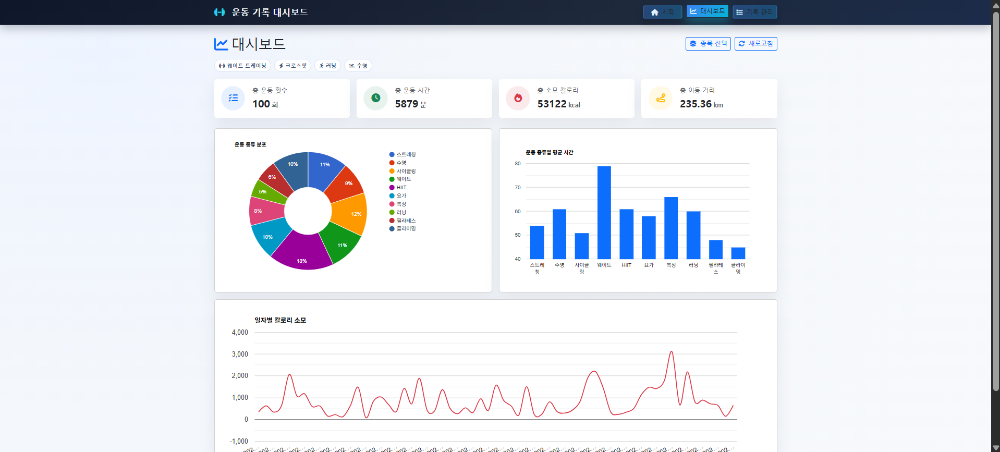
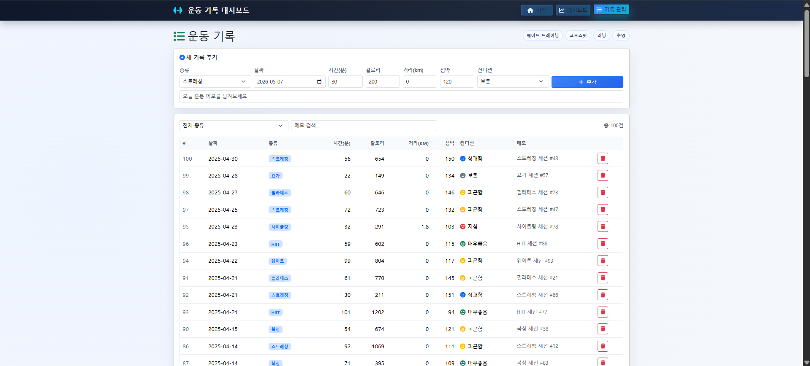
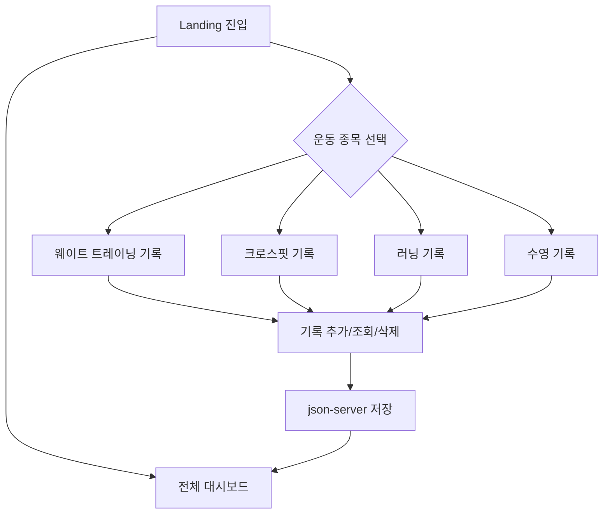
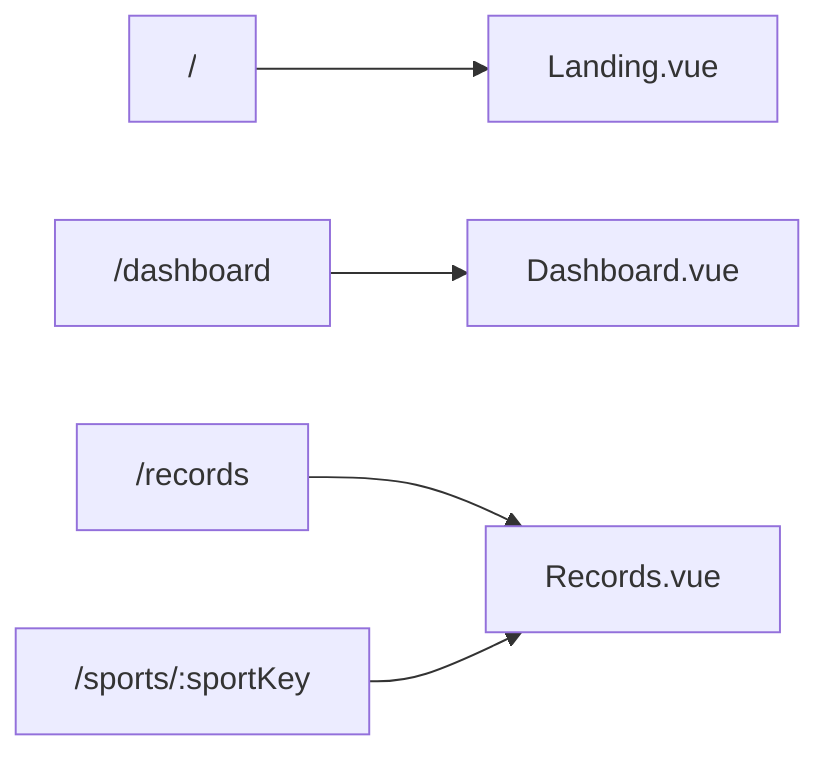
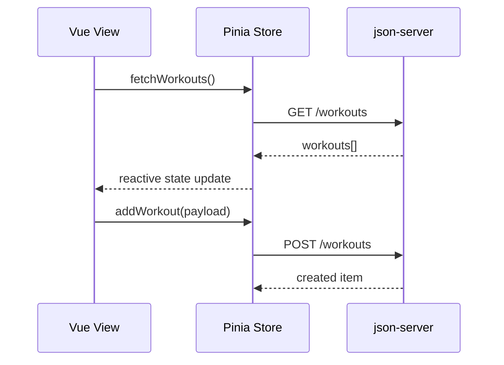

# AI Workout Tracker Dashboard

운동 데이터를 빠르게 기록하고, 시각적으로 분석할 수 있도록 설계한 Vue 기반 피트니스 대시보드 프로젝트입니다.  
랜딩에서 운동 목적에 맞는 종목을 고른 뒤, 종목 맞춤 기록 화면으로 진입하는 흐름을 제공합니다.

## Preview

### 1) Landing


### 2) Dashboard


### 3) Records


## 핵심 기능

- 종목 선택형 랜딩 페이지 (`/`)
- 전체 데이터 대시보드 (`/dashboard`)
- 종목 맞춤 기록 페이지 (`/sports/:sportKey`)
- JSON Server 기반 CRUD 기록 관리
- Google Charts 기반 통계 시각화
- 웨이트/크로스핏 전용 입력 필드
  - 운동 종목 드롭다운
  - 무게(kg), 횟수, 세트 입력

## 사용자 흐름



## 라우팅 구조



## 데이터 흐름



## Tech Stack

- Vue 3 (Composition API)
- Pinia
- Vue Router 4
- Axios
- Bootstrap 5
- vue-google-charts
- json-server
- Vite

## 프로젝트 구조

```bash
.
├── db.json
├── docs/
│   └── images/
│       ├── landing.png
│       ├── dashboard.png
│       └── records.png
├── src/
│   ├── components/
│   │   ├── StatCard.vue
│   │   └── WorkoutForm.vue
│   ├── constants/
│   │   └── sports.js
│   ├── router/
│   │   └── index.js
│   ├── stores/
│   │   └── workout.js
│   └── views/
│       ├── Landing.vue
│       ├── Dashboard.vue
│       └── Records.vue
└── package.json
```

## 실행 방법

```bash
npm install
npm run server
npm run dev
```

- Frontend: `http://localhost:5173`
- API: `http://localhost:3000/workouts`

## 개선 포인트

- 종목별 기록 맥락 강화를 위해 입력 폼 분기 적용
- 카드 반복형 레이아웃에서 섹션 중심 UI로 개선
- 재방문 편의성을 위해 최근 선택 종목 저장(localStorage) 적용
